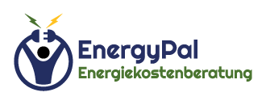

# EnergyPal.at

Website project

[energypal.at](https://energypal.at)

## ! Requirements

`./public/assets/images` and `./public/assets/videos` saved separately in Google Drive _(Backup > Websites > energypal.at)_

## To-Do

Change form submition method, becouse right now uses wordpress API endpoint.